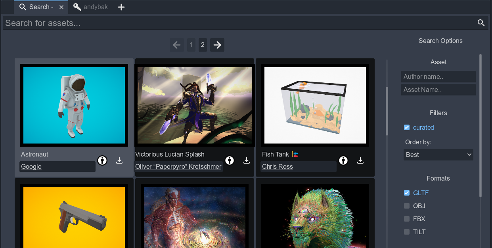
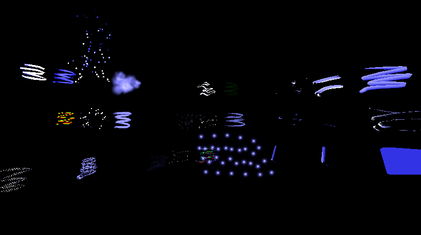

# Icosa Godot Addon

A Godot 4.5+ plugin that lets you browse the [Icosa Gallery](https://icosa.gallery) of curated 3D assets, download ready-to-use glTF packages, and keep the imported content aligned with Icosa's lighting setup without leaving the editor.

## Features

- **Asset browser** – Access a dockable main screen for searching Icosa's catalog, opening multiple result tabs, and duplicating thumbnails into preview tabs directly in the editor.
- **Account login** – Sign in with a device code to fetch your user profile, personal and liked assets so you can re-import anything from your Icosa library.
- **GLTF and OBJ Downloads** – Queue asset files for download, save them into per-asset folders, and track progress for every file in the bundle, including textures referenced by the glTF.
- **Runtime support** - Expose the browser to allow users of your game or app to download and instantiate Icosa assets at runtime. 
- **Open Brush Material replacement** – Imported models are derived from Open Brush sketches have their materials remapped with custom shaders.

## Installation

1. Download or clone this repository.
2. Copy the `addons/icosa` folder into your project's `res://addons` directory if it is not already there.
3. Open your project in Godot 4.5 or newer (Forward+ renderer is recommended, matching the demo project settings).
4. In the **Project > Project Settings > Plugins** tab, enable the **Icosa Gallery** plugin.

## Usage

1. After enabling the plugin, switch to the **Icosa Gallery** main screen tab that appears alongside the 3D, 2D, and Script editors.
2. Use the **Search** tab to look for assets. Apply filters such as curated assets, formats, triangle count, and ordering to refine results.
3. Click a thumbnail to open it in its own tab or duplicate it as a preview. Open multiple search tabs or asset previews as needed.
4. Select an asset to queue downloads; files are saved under `res://addons/icosa_downloads/{asset_name}_{asset_id}` by default, so referenced textures stay linked in the glTF. This can be changed in the settings menu.
5. Sign in through the **Login** tab to sync your Icosa account. Enter the device code in a browser, then return to Godot to fetch your profile, personal uploads, and liked assets.

## Hardcoded filters

1. By default, public assets are only returned if they have Creative Commons licenses that allow remixing
2. The Icosa Gallery HTTP API recommends which formats are most suitable for each format. If it suggests multiple formats, we pick the first one but prefer **glTF 2.0** over OBJ and FBX.

## Roadmap

## Open Brush Support Progress

* There are some global issues with color and contrast that need working on. This may or may not affect you depending on your use case.
* The shaders support two directional lights plus a global ambient light color. We try and automatically select the correct lights from your scene and track their settings in realtime. 
* Fog syncing is not implemented yet but you can manually set the fog parameters for each material if needed.
* No audio reactive support yet.

* Here's a list of all Open Brush's brushes annotated with their current support status in this addon:

| Standard Brush             | Status |
|----------------------------|---|
| Bubbles                    | |
| Cel Vinyl                  | |
| Chromatic Wave             | |
| Coarse Bristles            | |
| Comet                      | |
| Diamond                    | |
| Disco                      | |
| Dots                       | |
| Dr. Wigglez                | |
| Duct Tape                  | |
| Electricity                | |
| Embers                     | |
| Fire                       | |
| Flat                       | |
| Highlighter                | |
| Hyper Grid                 | |
| Hypercolor                 | |
| Icing                      | |
| Ink                        | |
| Light                      | |
| Light Wire                 | |
| Lofted                     | |
| Marker                     | |
| Matte Hull                 | |
| Neon Pulse                 | |
| Oil Paint                  | |
| Paper                      | |
| Petal                      | |
| Pinched Flat               | |
| Pinched Marker             | |
| Rainbow                    | |
| Shiny Hull                 | |
| Smoke                      | |
| Snow                       | |
| Soft Highlighter           | |
| Spikes                     | |
| Splatter                   | |
| Stars                      | |
| Streamers                  | |
| Tapered Flat               | |
| Tapered Marker             | |
| Thick Paint                | |
| Toon                       | |
| Unlit Hull                 | |
| Velvet Ink                 | |
| Waveform                   | |
| Wet Paint                  | |
| Wire                       | |

| Experimental Brush       | Status |
|--------------------------|---|
| Gouache                  | |
| 3D Printing Brush        | |
| Bubble Wand              | |
| Charcoal                 | |
| Concave Hull             | |
| Dance Floor              | |
| Dot Marker               | |
| Double Flat              | |
| Drafting                 | |
| Dry Brush                | |
| Duct Tape (Geometry)     | |
| Faceted Tube             | |
| Fairy                    | |
| Feather                  | |
| Fire2                    | |
| Geom/Thick (Duct Tape)   | |
| Gouache                  | |
| Guts                     | |
| Ink (Geometry)           | |
| Keijiro Tube             | |
| Lacewing                 | |
| Leaky Pen                | |
| Leaves2                  | |
| Lofted (Hue Shift)       | |
| Marbled Rainbow          | |
| Muscle                   | |
| Mylar Tube               | |
| Plasma                   | |
| Rain                     | |
| Rising Bubbles           | |
| Single Sided             | |
| Smooth Hull              | |
| Space                    | |
| Sparks                   | |
| Square Flat              | |
| Tapered Marker Flat      | |
| Tapered Wire             | |
| TaperedHueShift          | |
| Tube (Highlighter)       | |
| Tube Toon Inverted       | |
| Waveform FFT             | |
| Waveform Particles       | |
| Waveform Tube            | |
| Wind                     | |
| Wire (Lit)               | |
| Wireframe                | |

## Building & Contributing

Open the repository as a Godot project to iterate on the UI scenes (`browser.tscn`, `search.tscn`, etc.) and scripts under `addons/icosa`. Contributions are welcome via pull requests.

## License

This project is distributed under the terms of the [Apache License 2.0](LICENSE).
