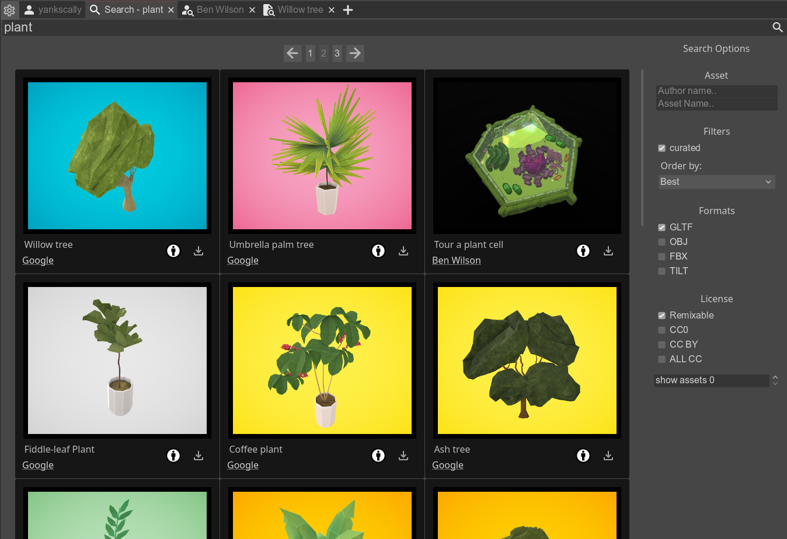
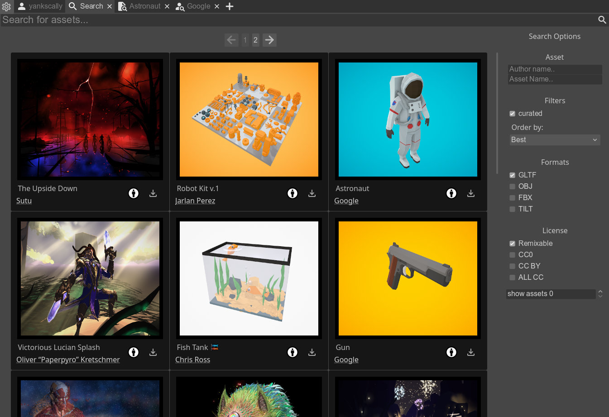

# Icosa Gallery - Godot Addon

A Godot 4.5+ plugin that lets you browse the [Icosa Gallery](https://icosa.gallery), a gallery of curated 3D assets, download ready-to-use glTF meshes without leaving the editor.

## Features

- **Asset browser** – Search Icosa's catalog, with tabs!
- **Account login** – Sign in with a device code to fetch your user profile, personal and liked assets so you can re-import anything from your Icosa library.
- **GLTF and OBJ Downloads** – Queue asset files for download, save them into per-asset folders, and track progress for every file in the bundle, including textures referenced by the glTF.
- **Runtime support** - Embed the browser in your project to allow users of your game or app to download and instantiate Icosa assets at runtime. 
- **Open Brush Material replacement** – Imported models are derived from Open Brush sketches have their materials remapped with custom shaders.

## Installation

1. Download or clone this repository.
2. Copy the `addons/icosa` folder into your project's `res://addons` directory if it is not already there.
3. Open your project in Godot 4.5 or newer (Forward+ renderer is recommended, matching the demo project settings).
4. In the **Project > Project Settings > Plugins** tab, enable the **Icosa Gallery** plugin.

## Usage

1. After enabling the plugin, switch to the **Icosa Gallery** main screen tab that appears alongside the 3D, 2D, and Script at the top of Godot Editor.
2. Use the **Search** tab to look for assets. Apply filters such as curated assets, formats, triangle count, and ordering to refine results.
3. Click a thumbnail to open it in its own tab, or open multiple search tabs or asset previews as needed.
4. Select an asset to queue downloads; files are saved under `res://addons/icosa_downloads/{asset_name}_{asset_id}` by default, so referenced textures stay linked in the glTF. This can be changed in the settings menu.
5. Sign in through the **Login** tab to sync your Icosa account securely in a web browser. Enter the device code in a browser, then return to Godot to fetch your profile, personal uploads, and liked assets.

## Hardcoded filters

1. By default, public assets are only returned if they have Creative Commons licenses that allow remixing.
2. The Icosa Gallery HTTP API recommends which formats are most suitable for each format. If it suggests multiple formats, we pick the first one but prefer **glTF 2.0** over OBJ and FBX.

## Roadmap

Open brush support: 

## Building & Contributing

Open the repository as a Godot project to iterate on the UI scenes (`browser.tscn`, `search.tscn`, etc.) and scripts under `addons/icosa`. Contributions are welcome via pull requests.

## License

This project is distributed under the terms of the [Apache License 2.0](LICENSE).
