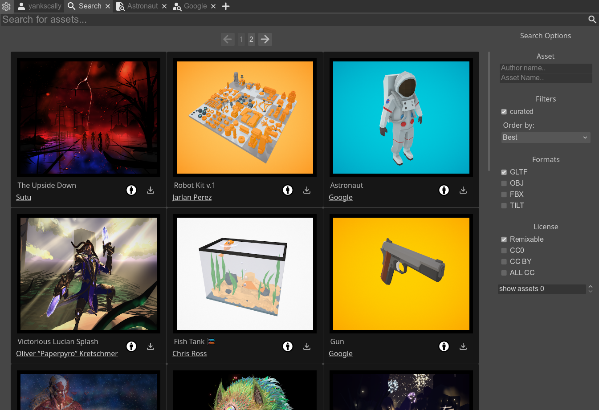
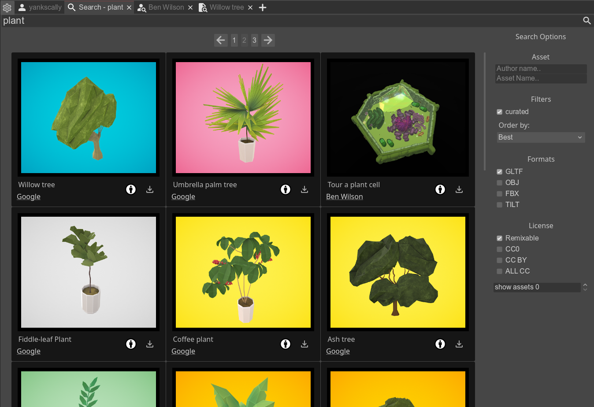

# Icosa Gallery - Godot Addon

A Godot 4.7+ plugin that lets you browse the [Icosa Gallery](https://icosa.gallery), a gallery of curated 3D assets, and download ready-to-use glTF meshes without leaving the editor.

## Features

1. **Asset browser** – Search Icosa's catalog in multiple tabs.
2. **Account login** – Sign in with a device code to access your profile, personal uploads, and liked assets.
3. **glTF and OBJ downloads** – Queue asset files, save them in per-asset folders, and track every file in the bundle, including textures referenced by glTF files.
4. **Runtime support** – Embed the browser in a project so users can download and instantiate Icosa assets at runtime.
5. **Open Brush material replacement** – Remap materials from legacy Tilt Brush/Open Brush glTF files and Open Brush UnityGLTF v2 exports to Godot brush shaders.

## Installation

### Godot Editor
If you have Godot Editor open, go to the AssetLib and search "icosa", download and install the addon and enable it.

### Otherwise..
1. Download or clone this repository.
2. Copy the `addons/icosa` folder into your project's `res://addons` directory if it is not already there.
3. Open your project in the Godot Editor.
4. In the **Project > Project Settings > Plugins** tab, enable the **Icosa Gallery** plugin.

## Usage

1. After enabling the plugin, switch to the **Icosa Gallery** main screen tab that appears alongside the 3D, 2D, and Script at the top of Godot Editor.
2. Use the **Search** tab to look for assets. Apply filters such as curated assets, formats, triangle count, and ordering to refine results.
3. Click a thumbnail to open it in its own tab, or open multiple search tabs or asset previews as needed.
4. Select an asset to queue downloads. In the editor, files are saved under `res://icosa_downloads/{asset_name}_{asset_id}` by default; runtime downloads use `user://icosa_downloads/{asset_name}_{asset_id}`. Change the destination in **Settings > Downloads**. Project-wide defaults are available under `icosa/downloads` in Project Settings.
5. Sign in through the **Login** tab to sync your Icosa account securely in a web browser. Enter the device code in a browser, then return to Godot to fetch your profile, personal uploads, and liked assets.

## Hardcoded filters

1. By default, public assets are only returned if they have Creative Commons licenses that allow remixing.
2. When the Icosa Gallery API marks a supported format as preferred, the addon downloads it. Otherwise, it chooses **glTF 2.0**, then falls back to OBJ. FBX and direct `.tilt` downloads are not supported.

## Open Brush support

See the [Open Brush support documentation](addons/icosa/open_brush/README.md) for supported exporters, material handling, and limitations.

## Building & Contributing

Open the repository as a Godot project to iterate on the UI scenes (`browser.tscn`, `search.tscn`, etc.) and scripts under `addons/icosa`. Contributions are welcome via pull requests.

## License

This project is distributed under the terms of the [Apache License 2.0](LICENSE).
