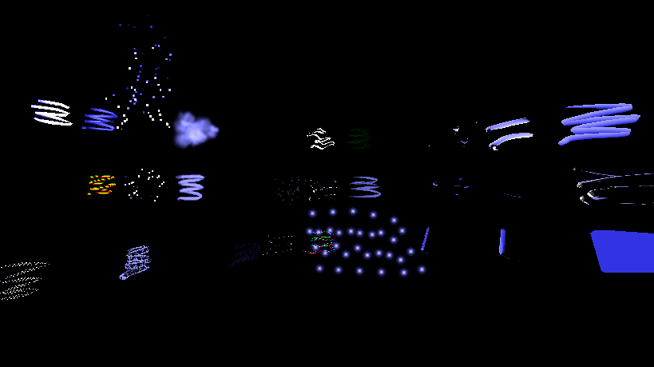

## Open Brush Support Progress

<explain open brush here to godot users>

* There are some global issues with color and contrast that need working on. This may or may not affect you depending on your use case.
* The shaders support two directional lights plus a global ambient light color. We try and automatically select the correct lights from your scene and track their settings in realtime. 
* Fog syncing is not implemented yet but you can manually set the fog parameters for each material if needed.
* No audio reactive support yet.

* Here's a list of all Open Brush's brushes annotated with their current support status in this addon:

| Standard Brush             | Status |
|----------------------------|---|
| Bubbles                    | |
| Cel Vinyl                  | |
| Chromatic Wave             | |
| Coarse Bristles            | |
| Comet                      | |
| Diamond                    | |
| Disco                      | |
| Dots                       | |
| Dr. Wigglez                | |
| Duct Tape                  | |
| Electricity                | |
| Embers                     | |
| Fire                       | |
| Flat                       | |
| Highlighter                | |
| Hyper Grid                 | |
| Hypercolor                 | |
| Icing                      | |
| Ink                        | |
| Light                      | |
| Light Wire                 | |
| Lofted                     | |
| Marker                     | |
| Matte Hull                 | |
| Neon Pulse                 | |
| Oil Paint                  | |
| Paper                      | |
| Petal                      | |
| Pinched Flat               | |
| Pinched Marker             | |
| Rainbow                    | |
| Shiny Hull                 | |
| Smoke                      | |
| Snow                       | |
| Soft Highlighter           | |
| Spikes                     | |
| Splatter                   | |
| Stars                      | |
| Streamers                  | |
| Tapered Flat               | |
| Tapered Marker             | |
| Thick Paint                | |
| Toon                       | |
| Unlit Hull                 | |
| Velvet Ink                 | |
| Waveform                   | |
| Wet Paint                  | |
| Wire                       | |

| Experimental Brush       | Status |
|--------------------------|---|
| Gouache                  | |
| 3D Printing Brush        | |
| Bubble Wand              | |
| Charcoal                 | |
| Concave Hull             | |
| Dance Floor              | |
| Dot Marker               | |
| Double Flat              | |
| Drafting                 | |
| Dry Brush                | |
| Duct Tape (Geometry)     | |
| Faceted Tube             | |
| Fairy                    | |
| Feather                  | |
| Fire2                    | |
| Geom/Thick (Duct Tape)   | |
| Gouache                  | |
| Guts                     | |
| Ink (Geometry)           | |
| Keijiro Tube             | |
| Lacewing                 | |
| Leaky Pen                | |
| Leaves2                  | |
| Lofted (Hue Shift)       | |
| Marbled Rainbow          | |
| Muscle                   | |
| Mylar Tube               | |
| Plasma                   | |
| Rain                     | |
| Rising Bubbles           | |
| Single Sided             | |
| Smooth Hull              | |
| Space                    | |
| Sparks                   | |
| Square Flat              | |
| Tapered Marker Flat      | |
| Tapered Wire             | |
| TaperedHueShift          | |
| Tube (Highlighter)       | |
| Tube Toon Inverted       | |
| Waveform FFT             | |
| Waveform Particles       | |
| Waveform Tube            | |
| Wind                     | |
| Wire (Lit)               | |
| Wireframe                | |
